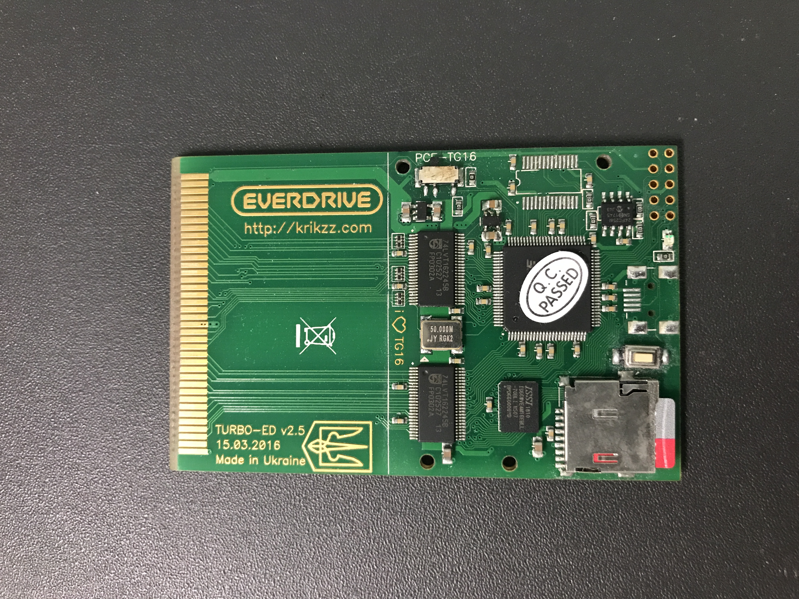

# PCE_TurboEverdrive_USB

# What is this "TurboEverdrive USB" thing ?

For those who have a TurboEverdrive v2.x from krikzz.com, there was originally
an optional USB port for sending files directly from PC to the cart. Developers
have been very happy with this functionality, but unfortunately, it is no longer
an option at the time of checkout on the site (only initial orders around 2015
had this option, I hear). All of the boards can have the option added later, however.

Note that version 1 boards do not have this option.
Also note that there are many boards being sold on ebay and AliExpress calling themselves
"Turbo Everdrives", but are not version 2.x TurboEverdrive boards.  Be careful to verify
which board you have before using this.

# What is actually new in this repository ?

The program which krikzz had written for data transfer to the Turbo Everdrive was
built only for Windows, and is only a command-line tool.

It can be found here (turbo-usb2.exe):
[https://krikzz.com/pub/support/turbo-everdrive/v2/usb-tool/](https://krikzz.com/pub/support/turbo-everdrive/v2/usb-tool/)

I have taken this tool, and reverse-engineered and reimplemented it in Python
so that it can be used on other platforms as well (i.e. linux).

# Can I add USB to my TurboEverdrive ?

If you're good at soldering, it's pretty straightforward, although 2022 is a time
of chip shortages, so you may not be able to get the required IC chip immediately.

IF YOU ARE NOT EXPERIENCED AT SOLDERING, I STRONGLY RECOMMEND TO REACH OUT TO
SOMEBODY WHO DOES CONSOLE MODIFICATIONS FOR ASSISTANCE.

The change itself is pretty straightforward.

### ELIGIBLE CARTS

The Turbo Everdrive cartridges versions 2.x are capable of having this added.
The cartridges look like this (prior to modification):

And they look like this (after modification):

### PARTS

You will need:
1. a USB-B mini socket, surface mount (such as Mouser part 649-10033526N3212MLF)
2. a FT245RL USB-to-parallel converter chip, SSOP-28 package (such as Mouser part 895-FT245RL-TUBE)

### SOLDERING

Be very careful to ensure that the chip's orientation (direction) is correct, and that the pins are
soldered without creating any solder bridges, which could cause damage or malfunction.  The pins are
very close to each other, and solder bridges are very likely for the inexperienced.

### PC SIDE SETUP & TEST

You will need to ensure that your PC has the FTDI Virtual COM Port drivers innstalled (if they aren't
already installed).

They can be found here:
[https://ftdichip.com/drivers/vcp-drivers/](https://ftdichip.com/drivers/vcp-drivers/)

